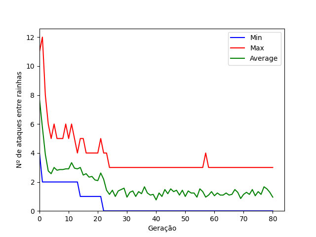

# Trabalho Prático 3 - Otimização

## Alunos
* 00302213 - Filipe Ilunga Xindanhi (turma A)
* 00326970 - Henrique Borges Manzke (turma A)
* 00302923 - Philippe Silva Pasquier (turma A)

## Genética da Realeza
Parâmetros escolhidos: `g`: 80, `n`: 20, `k`: 10, `m`: 0.6, `e`: 1
\
Para executar o algoritmo genético com o gráfico da evolução do algoritmo, duas modificações devem ser feitas no arquivo eight_queens.py
- Primeiro: Descomentar a linha 150, que plota o gráfico da execução atual do ga
- Segundo: Descomentar a linha 154, que faz a chamada do ga com os parâmetros anteriores.

Obs.: Como o crossover e a mutação possuem randomicidade, os gráficos gerados em cada execução serão diferentes.

## Não me perguntes onde fica o Alegrete...
